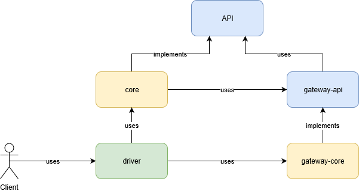

# Modular Service Archetype

This archetype is used to create a maven project structure inpired by Uncle Bob's Clean architecture concept. The following diagram exposes an overview of this model:

 

***

## Generated project structure

When using this archetype with these parameters:

	mvn archetype:generate -DarchetypeGroupId=ca.anynamus.archetype \
		-DarchetypeArtifactId=modular-service-archetype \
		-DgroupId=ca.anynamus.user \
		-DartifactId=user

the following directory and project structure is genarated. For simplycity, the generated packages have been removed:

	+---user-api
	|   \---src
	|       +---main
	|       |   +---java
	|       |   \---resources
	|       \---test
	|           +---java
	|           \---resources
	+---user-core
	|   \---src
	|       +---main
	|       |   +---java
	|       |   \---resources
	|       \---test
	|           +---java
	|           \---resources
	\---user-gateway
	|   \---user-gateway-api
	|       \---src
	|           +---main
	|           |   +---java
	|           |   \---resources
	|           \---test
	|               \---resources
	+---user-driver
	|

***

### Overview 

##### API

This module contains the interfaces for entities and use cases of the project.

##### Core

This module implements the entities and use cases defined into the API module.

##### Gateway API

This module contains the interfaces exposing the functionalities to access the entities by the mean of repositories.

##### Gateway Implementations

This project may contains one or more _gateway-api_ implementations. As an example, the user gateway may have an _in memory_ repository implementation for testing purpose and another JPA implementation for production.

##### Driver

A driver module is mainly how the service functionnality will be exposed to the rest of the world.

The _driver_ is a project of type `pom` because it may host more than one type of driver. As an example, the _core_ business logic may be exposed as as a web service as well as command line batch.

***

### References

##### mattia-battiston/clean-architecture-example

* [mattia-battiston/clean-architecture-example](https://github.com/mattia-battiston/clean-architecture-example "mattia-battiston/clean-architecture-example ") 

This project is a very good overview of the clean architecture's purpose. Note that this archetype's _gateway_ concept is the equivalent of the _dataprovider_ and that the _driver_ concept is the equivalent of the _entrypoints_ concept.

##### Blogs & Articles
* The Clean Architecture https://blog.8thlight.com/uncle-bob/2012/08/13/the-clean-architecture.html
* Hexagonal Architecture http://alistair.cockburn.us/Hexagonal+architecture

##### Videos & Presentations

* Robert C. Martin - Clean Architecture https://vimeo.com/43612849

##### Books

* Clean Architecture: A Craftsman's Guide to Software Structure and Design, by Robert C. Martin
 